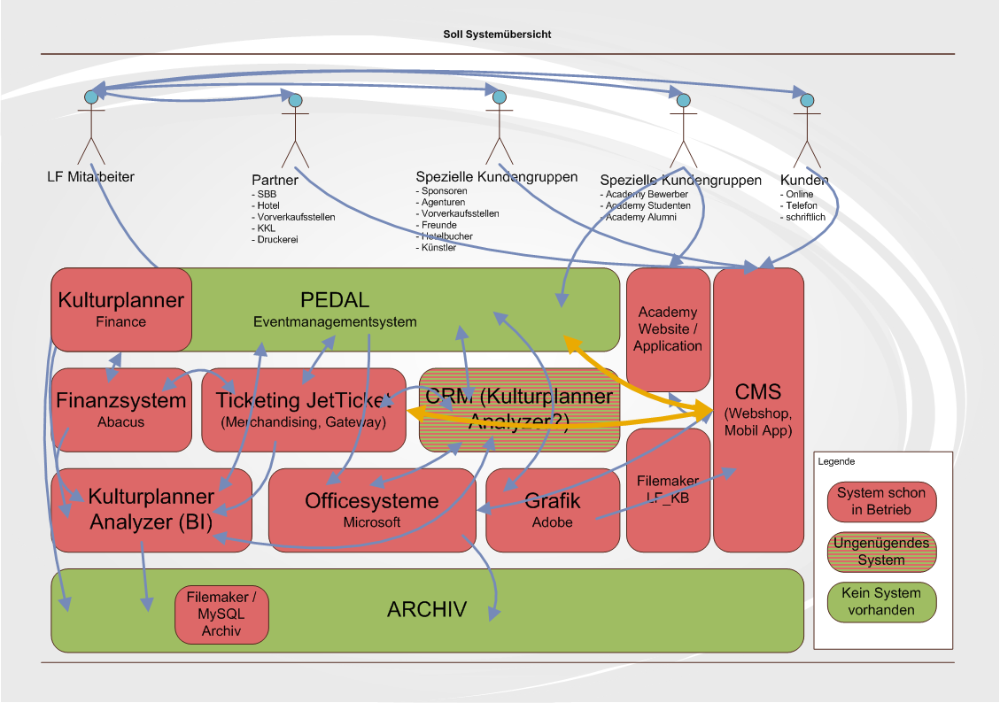
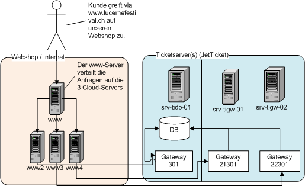
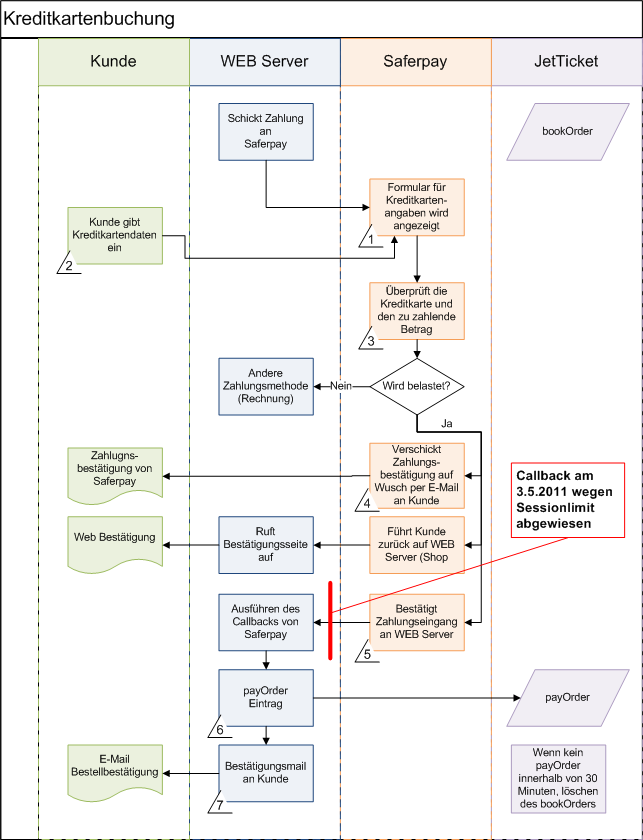

<!-- Editor Stefan Hofstetter -->

# Kickoff redesign Web

- Allgemein technische Tools
- LF Ticket Webshop

-----

# LF Ticket Webshop

In diesem Dokument sollen die wichtigsten Aspekte für die Implementation des Webshop geklärt werden.

## Inhalt
- Systemaufbau
- Komplexität Schnittstellen
- Anforderungen
- Vorschlag Architektur
- Testing

## Systemaufbau
### Übersicht interne Systeme und Schnittstellen

-----

### Systemaufbau Webshop bisher

## Anforderungen

- Ist-Stand
- Excel
- Neue Anforderungen und Verbesserungen

## Komplexität Schnittstellen
Anhand des Use Cases von 2011 wird die Schnittstelle zwischen Webshop und Kreditkarteservice erklärt.

## Testing

- Unittest 
- Lasttest mit Apache JMeter
- Automatisierte Fronttest mit Selenium

