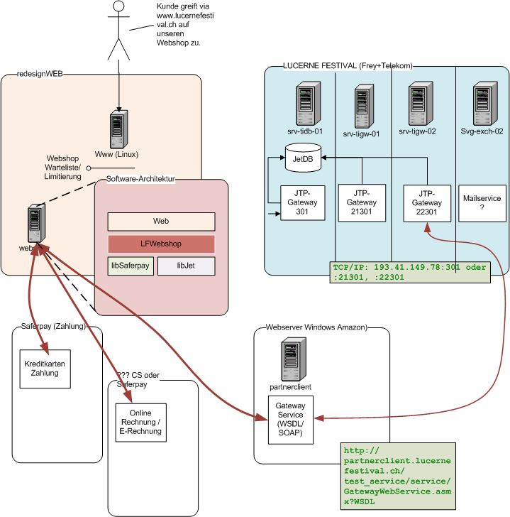

# Kickoff redesign Web

## Inhalt
- Allgemein technische Tools und Specs
    - Daten CMS bisher
- LF Ticket Webshop
	- Übersicht interne Systeme
	- Systemaufbau (alt/neu Vorschlag)
	- Komplexität Schnittstellen
	- Demo JTPVerkauf / Webshop alt / Gateway-Log auf DB
	- Testing / Umgebungen
- evtl. Anforderungen
	

# Allgemeine technische Tools und Specs

## Tools und Versionen
- Python 3 (.4)? / Django 1.7?
- github.com
- Datenbank MySQL/InnoDB oder Postgres?
- Entwicklungsumgebung(en)? z. B. pyCharm
- CI Continous Integration Server z. k. Jenkins oder
- CD Continous Delivery Server wie z. B. Wercker?
- sentry (logging Plattform?)
- Webserver: Apache, gunicorn?, nginx static
- Hosting: Amazon EC2, RDS oder ihr Vorschlag
- JavaScript Frameworks (AngularJS?)
- webcomponents
- async Technologie für Sitzplatzstatus wie asyncio oder nodejs
- Sphinx documentation?
- [Testing Webshop](#testing-webshop)

## Daten CMS ERM bisher ##
[ERM](CMS_LF_ER_Modell.pdf)

- Sprachkonzept via tblTexts, tblEntityTypes und tblLanguages

## Verbesserungen zum alten Modell ##
- tblComposer, tblConductors und tblPerformers sind einzelne Tabellen mit Personen, nun gibt es aber Personen welche Dirigent, Komponist und Künstler/Musiker sind, diese müssen im jetzigen Modell mehrmals erfasst werden. 
- tblEnsemble kann mit Performars bestück werden. Evtl. sollte man tblChoir mit einer ähnlichen Funktion ausstatten, oder man verallgemeinert eine Gruppenhierarchie und typsiert die Gruppen...

# LF Ticket Webshop #

In diesem Dokument sollen die wichtigsten Aspekte für die Implementation des Webshop geklärt werden.

## Übersicht interne Systeme und Schnittstellen ##

## Systemaufbau Webshop bisher ##

## Systemaufbau Webshop neu ##

## Wichtige Punkte
- Caching, wo und wie?
- Auswechselbare Systeme
- Seatpicker (Status) asynchron?
- Schnittstellen Kontrolle und aktive Meldungen

## Komplexität Schnittstellen ##
Anhand des Use Cases von 2011 wird die Schnittstelle zwischen Webshop und Kreditkarteservice erklärt.

## Demo ##
- JTPVerkauf
- Webshop alt
- Gateway-Log (SQL)
- JTPSystemsteuerung
- Python Code via WSDL/Soap

## Testing Webshop ##

- Unittest 
- Lasttest mit Apache JMeter
- Automatisierte Functionale Tests mit Selenium Beispiel
- Umgebungen Test, Integration (master), Live
- doctest?

# Anforderungen #
- Ist-Stand
- Excel
- Neue Anforderungen und Verbesserungen